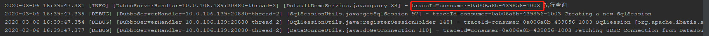
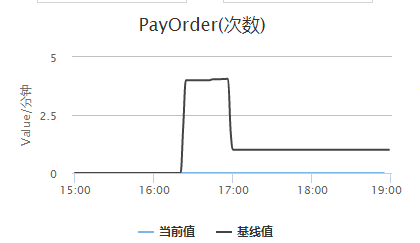

# 快速开始

## 启用Cat

1. 在项目`pom.xml`配置文件中引入以下内容
   
```xml
   <dependency>
       <groupId>org.rhine</groupId>
       <artifactId>cat-spring-boot-starter</artifactId>
       <version>1.0.0-SNAPSHOT</version>
   </dependency>
```

   

2. 通过注解`@EnableCat`启用追踪功能，示例代码如下：

   ```
   @SpringBootApplication
   @EnableCat
   public class ConsumerApplication {
   
       public static void main(String[] args) {
           SpringApplication.run(ConsumerApplication.class);
       }
   }
   ```

3. 配置远端服务器（用来收集应用上报日志内容）地址，格式如下：

   `public.cat.servers:10.0.57.197:8080:2280;`如果有多个服务中间用`;`隔开。

## 将追踪id记录到日志

如果应用使用的日志工具符合sl4j规范，在定义日志输出格式时加入`%X`即可将当前的追踪id记录到日志中。

示例如下：

```xml
<property name="LOG_PATTERN"
      value="%d{yyyy-MM-dd HH:mm:ss.SSS} [%level] [%thread] [%file:%M %line] - %X %msg%xEx%n"/>
```

日志输出内容如下：



## 业务统计埋点

业务统计埋点可以实时的显示当前业务系统的指标数据，例如如下的代码：

第一个参数是唯一的一个key，第二个数字参数表示累加数。

```java
public List<Config> query() {
    Cat.logMetricForCount("PayOrder", 1);
    return configMapper.query();
}
```

完成埋点后每次方法被调用时都会将统计的支付订单量+1，展现到看板中如下：



如果不想通过硬编码的方式完成业务埋点，也可以使用注解的方式，示例如下：

```java
@Override
@MetricForCount(name = "PayOrder")
public List<Config> query() {
    return configMapper.query();
}
```

作用和`Cat.logMetricForCount("PayOrder", 1);`是一样，**当被注解的方法执行过程中抛出异常时则当前的这个指标不会被统计**。

# 当前已支持追踪的技术栈

- 应用服务器提供的HTTP服务
- dubbo服务
- mybatis查询及更新


